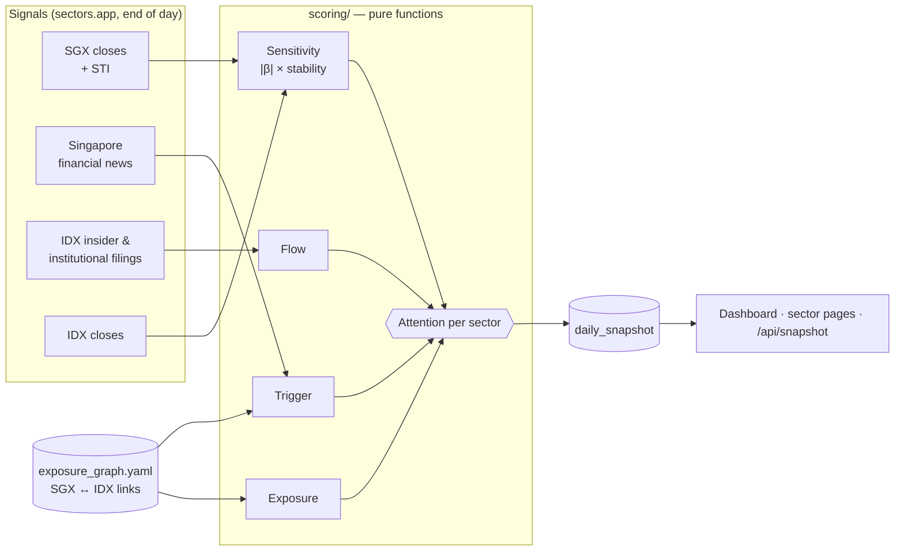
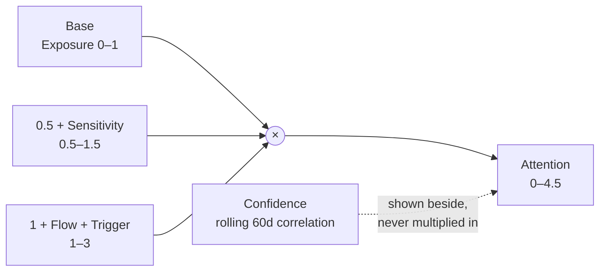
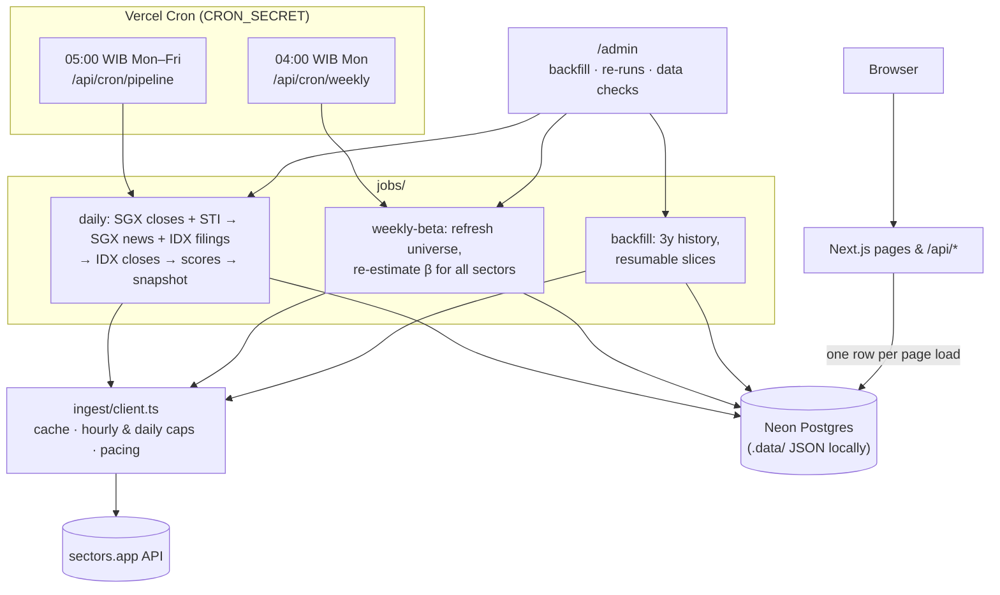
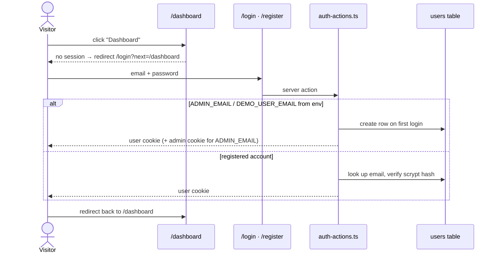
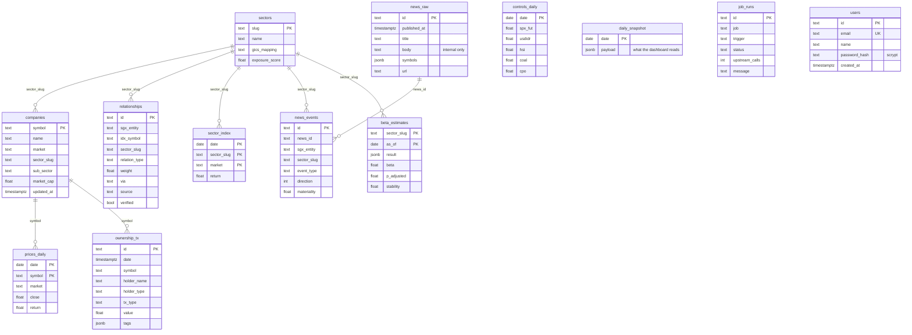

<p align="center">
  <picture>
    <source media="(prefers-color-scheme: dark)" srcset="public/brand/aida-logo-white.png">
    
  </picture>
</p>

# Aida

**Sector attention scoring for IDX, driven by Singapore market linkage.**

Sectors Hackathon 2026 · Track 3 · Market Intelligence

---

## Problem Statement

Aida helps IDX investors and analysts decide which sector to check first each morning by
connecting SGX price moves, Singapore corporate news, and insider transactions to the IDX
sectors structurally linked to them — signals that are otherwise scattered and rarely tied
together before the market opens.

---

## How It Works



Every weekday before 06:00 WIB the pipeline turns the previous session's data into one
snapshot row: an attention score for each of 11 IDX sectors, with every component kept
visible so a reader can see *why* a sector ranks where it does.

---

## Thesis

More than 20 SGX-listed companies run their core operations in Indonesia — across REITs,
energy, industrials, materials, consumer and natural resources. Several IDX blue chips are
majority-owned or significantly held by Singapore entities. SGX also opens one hour ahead of
IDX in WIB.

We do not assume this linkage produces a tradeable signal. **We test it, per sector, and
report where it holds and where it does not.**

---

## What This Is Not

- Not an investment recommendation engine. Output is an *attention score* — which sector
  deserves a closer look today, not what to buy.
- Not a claim of causality. Score components are explicitly separated so that structural
  exposure, historical sensitivity, and today's trigger can each be inspected independently.

---

## Scoring Model

Four components, multiplicative rather than a weighted sum:

```
Base        = Exposure(sector)                  # structural, static
Sensitivity = |beta| x stability                # historical, weekly refresh
Flow        = insider / institutional intensity # daily, deterministic
Trigger     = event intensity from news         # daily, rule-based

Attention   = Base x (0.5 + Sensitivity) x (1 + Flow + Trigger)
Confidence  = rolling 60d correlation           # shown separately, never folded in
```



Multiplicative structure means a sector needs **all three conditions** to rank high: it must
be structurally connected, historically responsive, and have a trigger today. A weighted sum
would let a single loud component carry a sector that has no real linkage.

Flow and Trigger enter the score as **direction-free intensities** in 0–1 (`tanh` of the
magnitude): heavy insider selling deserves attention as much as heavy buying. The signed
values are kept and shown on the sector page. Maximum attention is 1 × 1.5 × 3 = 4.5.

### 1. Exposure (Base) — `scoring/exposure.ts`

Market-cap-weighted sum of SGX↔IDX relationships per sector: for each linked company,
`weight(relation) × market cap / sector market cap`. Each IDX emiten counts once, at its
strongest relation (a parent already implies the board overlap). SGX-only rows use the SGX
company's cap converted at an approximate SGD→IDR rate.

| Relationship | Weight |
|---|---|
| Parent / controlling shareholder | 1.0 |
| Significant shareholder (incl. indirect control) | 0.7 |
| SGX-listed, primary operations in Indonesia | 0.6 |
| Commodity / trade channel | 0.4 |
| Board overlap only | 0.2 |

Seeded from a curated mapping in `data/exposure_graph.yaml`, cross-checked against
`holder_name` values in the IDX ownership-transaction endpoint (matches are listed on the
methodology page).

### 2. Sensitivity (beta) — `scoring/sensitivity.ts`

Per-sector regression of IDX return on lagged SGX return, with global controls:

```
r_IDX(t) = a + b1*r_SGX(t-1) + b2*r_SPX_fut + b3*d(USDIDR) + b4*r_HSI + e
```

- Rolling window: 250 trading days
- `p > 0.05` after Benjamini-Hochberg correction across the 11 sectors → Sensitivity = 0
- Stability = fraction of rolling windows (every 5 days) where beta keeps its sign
- Lead-lag tested in **both directions** — the thesis includes ID→SG influence
- "Lagged" means the other market's previous session, not index − 1: SGX and IDX keep
  different holidays
- **T+0 vs T+1.** The lagged regression above is T+1 (yesterday's SGX → today's IDX) and is the
  only one scored. T+0, `r_IDX(t)` on the same day's `r_SGX(t)`, is estimated and
  BH-corrected alongside it and shown on the methodology page: it measures how tightly the two
  markets move together, but it cannot be acted on before the IDX open, so it never enters the
  score
- `r_SGX` is the exposure-weighted basket of the sector's linked SGX entities, or the STI
  when a sector has no linked entity with enough history

### 3. Flow — `scoring/flow.ts`

Derived from IDX insider and institutional ownership transactions. Fully deterministic,
no model involved.

```
signal = +1 if transaction_type == "buy" else -1   ("others" → 0)
score  = signal * log1p(transaction_value) * holder_weight * time_decay
```

30-day lookback, 7-day half-life; holder weights insider 1.0, corporate investor 0.8,
institution 0.6. Transactions tagged `placement` or `repurchase-agreement` are down-weighted
(× 0.25) — these are financing mechanics, not conviction.

### 4. Trigger — `scoring/trigger.ts`

Rule-based event taxonomy over Singapore financial news. **No LLM in the scoring path** —
classification is regex over an event dictionary, making scores deterministic, free to
backtest across the full archive, and auditable line by line.

Event categories: `profit_warning`, `divestment`, `acquisition`, `regulatory`,
`export_policy`, `capital_raise`, `dividend` (`data/event_taxonomy.yaml`). Negation handling
inspects the 5 preceding tokens. Headline matches carry 2x the weight of body matches.
Entity resolution maps mentions to tickers via `data/entity_aliases.yaml` (plus the
provider's own symbol tags), then to IDX sectors via the exposure graph. 3-day lookback,
1-day half-life, measured to 06:00 WIB on the snapshot day.

An LLM is used in exactly one place: composing the human-readable Morning Brief from
already-computed scores (`jobs/brief.ts`). It never influences a number, and a
deterministic template takes over whenever the model is unavailable.

---

## Sector Universe

11 of the 12 IDX-IC sectors. `Listed Investment Product` is excluded — it holds ETFs and
investment vehicles rather than operating companies, so its returns are derivative of other
sectors and would produce spurious correlation.

IDX-IC sector indices are not available upstream, so each sector's daily return is the
market-cap-weighted return of its 5 largest emiten (`AIDA_TOP_N`).

Sub-sector level (~35) is used for display drill-down only, never for scoring — testing 35
hypotheses would surface false positives by chance alone.

---

## Architecture

Single morning fetch, persisted, served to all users from our own API. The upstream data
provider is hit once per day regardless of traffic.



Upstream is never touched on read: the snapshot is ready by 06:00 WIB and every visitor is
served from our own database.

Users get the day's snapshot before the IDX open without anyone running anything. sectors.app
prices are end-of-day, so the snapshot scores the previous session; there is no intraday
feed upstream. Vercel Hobby fires a cron anywhere within its hour, hence 05:00–05:59.

### Admin

`/admin` is password-gated (`ADMIN_PASSWORD`; signed httpOnly session cookie, checked in
`proxy.ts` and again in every admin page and server action). It is where an admin:

- sees whether users have today's snapshot, and whether it is live data (not mock)
- checks price coverage and depth per symbol, beta age, news and filing freshness, and
  exposure-graph links that do not resolve to a market cap
- reads the raw inputs — SGX headlines with the events the taxonomy detected, ownership
  filings with their Flow score — which never leave the admin area
- runs the backfill (resumable in ~4-minute slices), the pipeline, single stages, or the
  weekly beta; every run is logged in `job_runs` with its upstream call count

Dashboard pages read a single pre-computed snapshot row per day. Page loads cost zero
upstream calls. Crons are `vercel.json` → `/api/cron/{pipeline,weekly}`, guarded by
`Authorization: Bearer $CRON_SECRET`; single stages (`sgx`, `news`, `score`) run from
`/admin` or the CLI.

### Accounts

The landing page, methodology and sector pages are public; **the dashboard requires an
account**. Every "Dashboard" link sends a signed-out visitor to `/login?next=/dashboard` and
back again after signing in.



- **Register / login** at `/register` and `/login`: name, email, password (min. 8 chars).
  Passwords are stored as scrypt hashes; the session is a stateless `<userId>.<expiry>.<hmac>`
  httpOnly cookie signed with `AUTH_SECRET`, valid 30 days. Wrong email and wrong password
  return the same message after the same delay.
- **Env accounts** sign in without registering: the admin (`ADMIN_EMAIL` + `ADMIN_PASSWORD`,
  which also opens `/admin`) and an example user (`DEMO_USER_*`). Their emails cannot be
  claimed through `/register`.
- **Keluar** (sign out) clears both the user and the admin session.
- `/admin/login` still accepts `ADMIN_PASSWORD` alone, for operating the pipeline without a
  user account.

### Note on redistribution

Raw upstream data is stored for internal computation only. The public API exposes **derived
values** — attention scores, betas, exposure weights, event types and aggregate counts. News
events carry a link to the source, never the article text. Verify the provider's terms before
exposing any raw price or news payload.

---

## Repository Structure

A single Next.js package; the module boundaries follow the plan without a workspace split.

```
aida/
├── app/                          # Next.js app (server components)
│   ├── page.tsx                  # landing: LED-board hero, live ranking preview
│   ├── dashboard/                # sector ranking board (sign-in required)
│   ├── sector/[slug]/            # score breakdown + linked entities
│   ├── methodology/              # regression results, validation, limitations
│   ├── login/ · register/        # account pages (pixel theme, components/AuthPage.tsx)
│   ├── admin/                    # password-gated monitoring and job runs
│   ├── api/
│   │   ├── snapshot/             # today's scores (reads DB only)
│   │   ├── sector/[slug]/
│   │   └── cron/[job]/           # pipeline + weekly, CRON_SECRET-guarded
│   ├── lib/
│   │   ├── auth.ts               # password hashing, user session, env accounts
│   │   ├── auth-actions.ts       # register / login / logout server actions
│   │   └── admin*.ts             # admin session
│   └── icon.svg · favicon.ico · apple-icon.png   # generated from the logo
│
├── db/
│   ├── schema.ts                 # Drizzle schema
│   ├── migrations/
│   ├── store.ts                  # storage interface
│   ├── pg-store.ts               # Postgres / Neon
│   └── file-store.ts             # JSON files under .data/ until DATABASE_URL exists
│
├── ingest/                       # all upstream calls live here, nowhere else
│   ├── client.ts                 # memo, disk cache, hourly cap, pacing, retry
│   ├── prices.ts                 # 90-day window pagination
│   ├── universe.ts               # screeners: sector + market cap
│   ├── news.ts
│   ├── ownership.ts
│   └── controls.ts               # SPX futures, USDIDR, HSI from local CSV
│
├── scoring/                      # pure functions, no I/O
│   ├── exposure.ts
│   ├── sensitivity.ts            # beta, p-value, BH correction, stability
│   ├── flow.ts
│   ├── trigger.ts                # event taxonomy + entity resolution
│   ├── confidence.ts
│   ├── compose.ts                # final attention score
│   ├── snapshot.ts               # one day, assembled
│   └── scoring.test.ts
│
├── jobs/
│   ├── backfill.ts               # one-off, 3y history, plans calls first
│   ├── daily.ts                  # the three morning stages
│   ├── weekly-beta.ts
│   ├── brief.ts                  # Morning Brief (the only LLM call)
│   └── run.ts                    # CLI
│
├── data/
│   ├── exposure_graph.yaml       # curated SGX <-> IDX relationships
│   ├── entity_aliases.yaml       # name variants -> ticker
│   ├── event_taxonomy.yaml       # regex patterns, direction, materiality
│   └── controls/                 # optional <series>.csv (date,value)
│
├── research/
│   ├── 01_leadlag_validation.ts  # RUN THIS FIRST
│   └── 02_out_of_sample.ts
│
├── scripts/
│   ├── sectors-mock.mjs          # local sectors.app stand-in, counts calls
│   └── db-check.ts               # Postgres store round-trip on PGlite
│
└── public/brand/                 # logo PNGs (white, dark, app icon) at 1024 px
```

The research files are TypeScript scripts rather than notebooks so they run on the exact
scoring code the dashboard uses.

---

## Database Schema



Relationships are logical (joined in code); the tables carry no foreign keys, so ingest can
write any table in any order. `daily_snapshot` stores the entire computed day as one row —
the dashboard performs exactly one query. `users` holds site accounts (migration
`0003_users`).

---

## Setup

```bash
npm install
cp .env.example .env        # SECTORS_API_KEY, ADMIN_*, DEMO_USER_*, AUTH_SECRET, CRON_SECRET
neon link --project-id <id> --branch production -y   # pulls DATABASE_URL into .env
npm run db:migrate          # includes the users table
npm run dev                 # then /admin → Rencana backfill → Jalankan backfill
npm run research:leadlag    # validate before trusting the Sensitivity column
```

The backfill can also run from the CLI (`npm run ingest:backfill -- --plan`, then `--yes`).
Other commands: `npm run job:daily -- [sgx|news|score|pipeline]`, `npm run job:weekly`,
`npm test` (scoring unit tests), `npx tsx scripts/db-check.ts` (Postgres store on PGlite).

**Environment for accounts:** `AUTH_SECRET` (`openssl rand -base64 32`) is required in
production — without it `/login` and `/register` show a disabled notice; `next dev` falls
back to a dev-only secret. `ADMIN_EMAIL` / `ADMIN_NAME` and `DEMO_USER_NAME` /
`DEMO_USER_EMAIL` / `DEMO_USER_PASSWORD` define the env accounts; leave a password empty to
disable that account. Set the same variables in Vercel and redeploy.

**Quota warning:** the price history endpoint caps at 90 days per call, so three years
requires pagination: ~13 calls per symbol, ~1,000 calls for the default 55 IDX + 17 SGX
symbols. `--plan` prints the estimate. Every raw response is cached under `.cache/sectors/`
and closed historical windows never expire, so a re-run only pays for what is missing.

**Free end-to-end run:** `npm run mock:sectors`, then run any job with
`SECTORS_API_BASE=http://127.0.0.1:4010/v2 SECTORS_API_KEY=mock AIDA_DATA_DIR=.data-mock`.
Mock snapshots are labelled as synthetic on every page.

**Controls:** sectors.app has no daily S&P futures, USD/IDR or Hang Seng series. Drop
`data/controls/{spx_fut,usdidr,hsi,coal,cpo}.csv` (`date,value` levels) to include them;
until then the regression runs without them and the methodology page says so.

---

## Limitations

- Predictive window is narrow — the one-hour lead exists only between the SGX open and the
  IDX open. After 09:00 WIB the markets run in parallel. Upstream prices are end-of-day, so
  the morning score uses the previous IDX session.
- Cross-market research suggests Singapore leads regional peers at longer horizons rather
  than daily ones. Daily beta may therefore be weak even where the structural linkage is
  real. This is why Exposure, not beta, is the base of the score.
- Sector returns are a proxy (top-N constituents at today's market caps), which carries
  survivorship bias and non-historical weights.
- Taxonomy mapping between IDX-IC and GICS is imperfect. `Infrastructures`,
  `Transportation & Logistics`, and `Technology` have no clean GICS counterpart, and results
  for those sectors should be read with lower confidence.
- The exposure graph is partly hand-curated and therefore incomplete; rows are marked
  unverified until checked against annual reports.
- Commodity prices are currently used as controls only, not as a first-class channel.

---

## Roadmap

- Commodity channel as a scored component rather than a control
- Foreign net flow (available upstream: `/v2/foreign-flow/`)
- Regime-switching model instead of a static rolling window
- Intraday price reaction as the ground-truth label for news sentiment, replacing the event
  taxonomy entirely

---

## Team

| Name | Role |
|---|---|
| | |
| | |
| | |

## Data Source

Sectors API — Indonesian and Singapore market data.
Derived scores only; raw upstream payloads are not redistributed.

## Disclaimer

Not investment advice. Attention scores indicate where to direct research, not what to buy
or sell.
